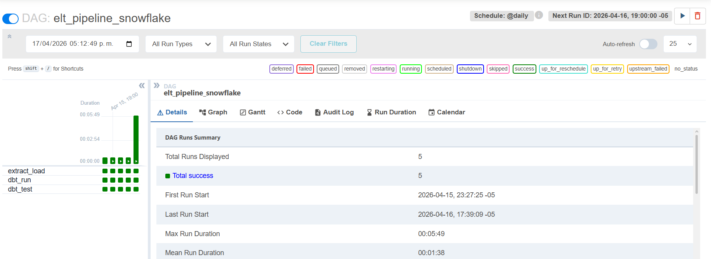
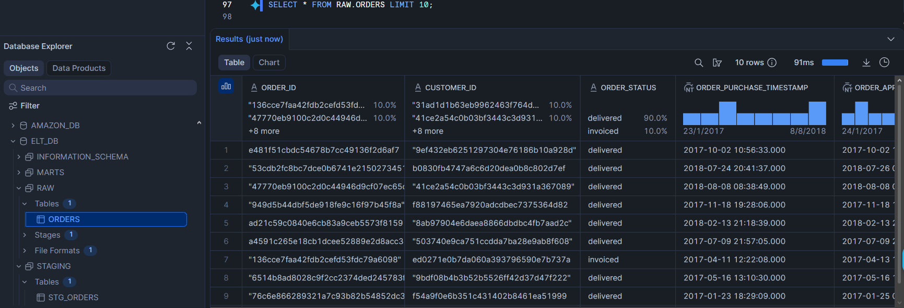
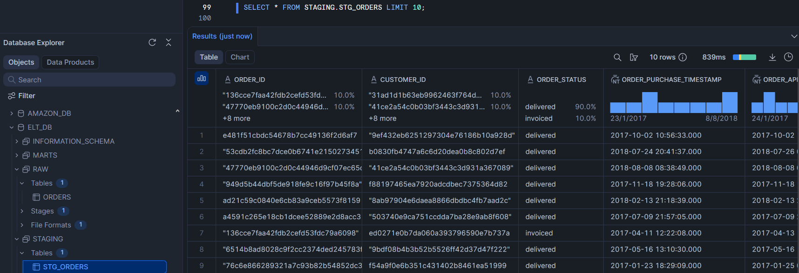
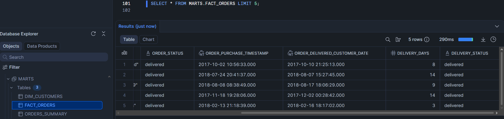
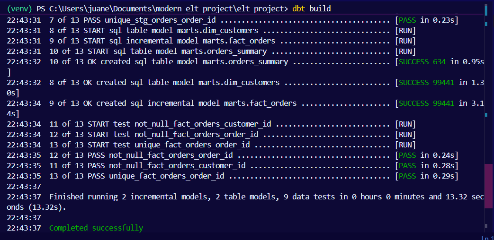
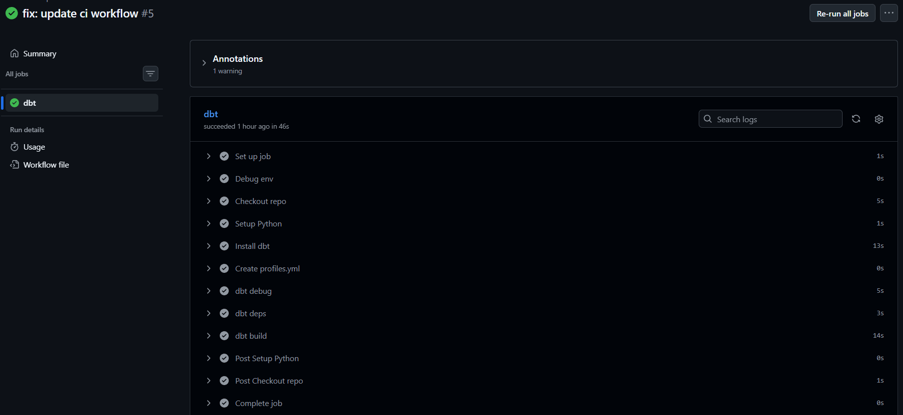

# Modern Data Stack ELT Pipeline (Snowflake + dbt + Airflow + CI/CD)

## Overview
This project implements an end-to-end **ELT (Extract, Load, Transform)** data pipeline using a modern data stack. It simulates a real-world data engineering workflow, from raw data ingestion to analytics-ready data models, following industry best practices.

The pipeline integrates:
* **AWS S3** → Raw data storage (Data Lake).
* **Snowflake** → Cloud Data Warehouse.
* **dbt (data build tool)** → Data transformation and modeling.
* **Apache Airflow** → Pipeline orchestration.
* **GitHub Actions** → CI/CD for automated data and code validation.

---

## Architecture
The data flow follows a linear, modular, and scalable structure:

`S3 (Raw Data)` ➔ `Snowflake (RAW layer)` ➔ `dbt (STAGING layer)` ➔ `dbt (MARTS layer)` ➔ `Analytics / BI`

---

## How It Works

### 🔹 1. Data Ingestion (Airflow)
* Extracts raw data (CSV/JSON) stored in **AWS S3**.
* Uses the `COPY INTO` command to efficiently load data into **Snowflake** landing schemas (Layer: `RAW`).

### 🔹 2. Data Transformation (dbt)
* **Staging Layer (STAGING):** Handles raw data cleaning, column renaming for consistency, and data type casting.
* **Marts Layer (MARTS):** Builds dimensional models (Star Schema) ready for business use through Fact and Dimension tables.

### 🔹 3. Data Quality (Tests)
Native dbt tests are used to ensure integrity during every execution:
* `unique` and `not_null` constraints on primary keys.
* Referential integrity (relationships between tables).
* Source freshness validation.

### 🔹 4. CI/CD (GitHub Actions)
Whenever a **Pull Request** is opened or a **Push** is made, an automated workflow is triggered:
1.  **Setup:** Configures the Python and dbt environment.
2.  **dbt debug:** Validates secure connection to Snowflake using GitHub Secrets.
3.  **dbt build:** Runs all models and executes quality tests atomically.

---

## Technologies Used
* **Languages:** Python, SQL (Snowflake Dialect).
* **Infrastructure:** AWS S3 (Data Lake), Snowflake (Data Warehouse).
* **Transformation:** dbt (data build tool).
* **Orchestration:** Apache Airflow.
* **DevOps/CI-CD:** GitHub Actions, Git.

---

## Data Layers in Snowflake
| Layer | Description |
| :--- | :--- |
| **RAW** | Initial ingestion from S3. Immutable data in raw format. |
| **STAGING** | Cleaned, typed, and prepared data for modeling. |
| **MARTS** | Final models optimized for BI and decision-making. |

---

---

## Evidence

### 🔹 1. Airflow DAG Execution
* **Status:** Success (All tasks in green).
* **Tasks:** `extract_load_task`, `dbt_run_task`, `dbt_test_task`.

### 🔹 2. Snowflake Data Layers
* **RAW Layer:** Shows ingested data from S3.

* **STAGING Layer:** 

* **MARTS Layer:** 

### 🔹 3. dbt Execution & Testing
* **Command:** `dbt build`
* **Result:** `PASS=X ERROR=0 SKIP=0`

### 🔹 4. CI/CD Pipeline (GitHub Actions)
* **Workflow:** `dbt CI Pipeline`
* **Status:** Completed successfully (Green check ✅).

## Key Features
* **Idempotency:** Processes can be run multiple times without duplicating data or breaking the system.
* **Layered Architecture:** Clear separation of concerns (RAW, STAGING, MARTS).
* **Automated Validation:** Code is automatically tested before merging into the main branch.
* **Security First:** Strict use of `.gitignore` and **GitHub Secrets** to protect sensitive credentials.

 

## 👨‍💻 Author
**Juan Esteban Franco**  *Devops | Data Engineer*

---
